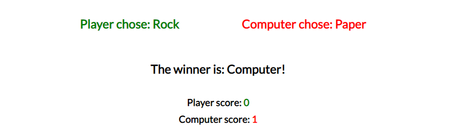
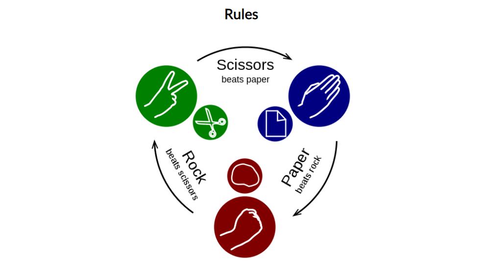
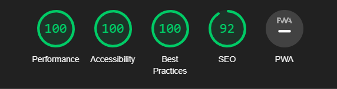

# Rock, Paper, Scissors

This website allows you to play the classic game of rock, paper, scissors against the computer. The rules of the game are simple: rock beats scissors, scissors beat paper, and paper beats rock. When you load the website you get to choose between rock, paper or scissors. The computers choice is random every time. There is a counter which keeps track of how many times you, the player, have won and how many times the computer have won. 

Users of this website will learn the game Rock, Paper, Scissors and can use it if they need an external decision maker. This web based game will be targeted towards all age groups, everyone can play it and have fun.

## Features
---
- **Rock, Paper, Scissors Heading**
    - At the top of the website is the heading. When loading the site the user will be able to see that the game is Rock, Paper, Scissors.

- **The Three Choices**
    - Here the user sees three buttons with the text: Rock, Paper or Scissors. The user will be able to select one of the three to play this round.

- **Display Area**
    - Here is where the choices of the player and the computer shows up. Who of the two is this rounds winner or if it is a tie.
    - The user will also be able to find the score counter here.

- **Restart Button**
    - The restart button can be clicked when the player wants to start a new game. It resets the score to zero.

- **Rules**
    - Under the Rules heading is where the user can find a picture, with alt text, showing the rules of the game.

- **Features Left to Implement**
    - I would like to add pictures alongside the rock, paper, scissors text.
    - In the future I hope to add a two player mode.

## Testing
---

- I have tested the game on Chrome.

- I confirmed that the results of the game are always correct.

- I confirmed that the buttons and text on the site are easy to read and understand.

- I confirmed that the site is responsive and looks good on different screen sizes.

- I ran the site through Lighthouse in devtools to confirm that the site is accessible.

### **Validator Testing**

- HTML
    - The website returned no errors when testing using the official W3C validator

- CSS
    - The website returned no errors when testing using the official (Jigsaw) validator

- JavaScript
    - The website returned no errors when testing using the official Jshint validator
        - The following metrics were returned:
        - There are 2 functions in this file.
        - Function with the largest signature take 1 arguments, while the median is 0.5.
        - Largest function has 24 statements in it, while the median is 15.5.
        - The most complex function has a cyclomatic complexity value of 14 while the median is 7.5.

### **Bugs**

### Solved Bugs
- When testing the game after writing the JavaScript I had a bug were the computer got a point when the player chose Rock and the computer chose scissors. So it counted the players win towards the computers score.
- I found that in the if statement I had written `scoreRed.innerHTML` instead of `scoreGreen.innerHTML`.
- The solution was to change the wrong `scoreRed.innerHTML` to `scoreGreen.innerHTML`.

### Unfixed Bugs
- I am having trouble with getting my footer to stay at the bottom of the page. Hopefully something I can fix in the future.

## **Credits**

### Content
- I got the code to fix the image responsiveness from this [w3schools](https://www.w3schools.com/howto/howto_css_image_responsive.asp) link.
- I got the code base and concept for the Restart button from this [stack overflow](https://stackoverflow.com/questions/58801596/how-to-create-a-reset-button-in-a-js-game) page.

### Media
- I found the Rules image on this [wikimedia](https://commons.wikimedia.org/wiki/File:Rock-paper-scissors.svg) page.
